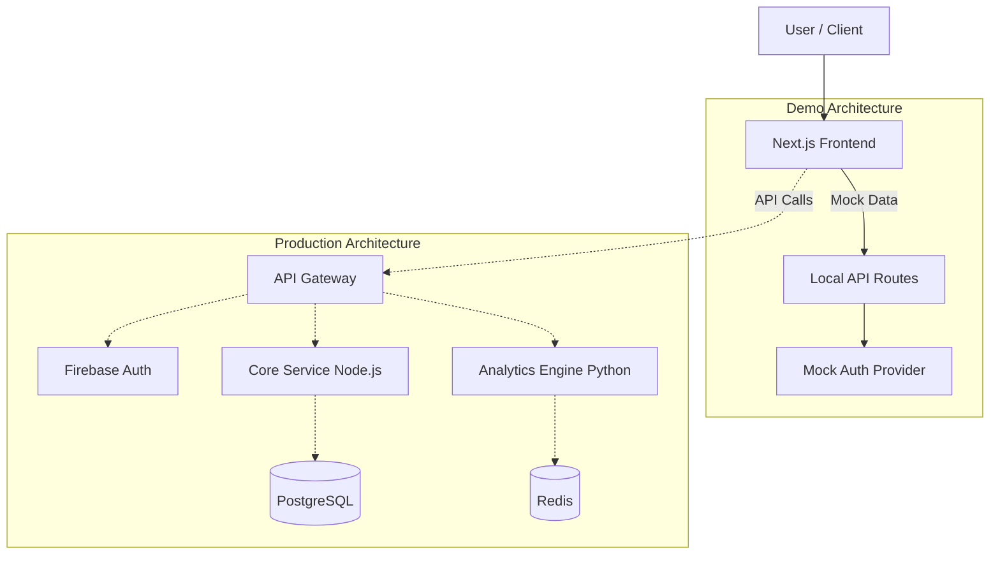

# Beginner Investor Hub (Demo)


This is a production-quality demo showcasing frontend architecture, UX, and system design for a larger AI-driven financial education platform. A precision-engineered educational platform for mastering investment strategies. This repository contains the frontend demo application.

Badges: [add CI / tests / Vercel badges as appropriate]

Table of contents

- [Purpose](#purpose)
- [Tech stack](#tech-stack)
- [Core capabilities](#core-capabilities)
- [Architecture](#architecture)
- [Demo mode](#demo-mode)
- [Local development](#local-development)
- [Environment variables](#environment-variables)
- [Testing](#testing)
- [Deployment](#deployment)
- [Disclaimer](#disclaimer)
- [License](#license)
- [Author](#author)

## Purpose

This is a demo deployment showcasing the frontend architecture and user experience. Backend services are mocked so the demo can be evaluated without paid cloud infrastructure.

## Tech stack

- Framework: Next.js (Pages Router)
- Language: TypeScript
- Styling: Tailwind CSS
- Design tokens: Mechanica
- UI: Headless UI + custom components
- State: Zustand
- Auth: NextAuth.js (mocked in demo)
- Tests: Jest (unit), Playwright (E2E)
- Deployment: Vercel

## Core capabilities

| Feature               | Description                                    | Status         |
| --------------------- | ---------------------------------------------- | -------------- |
| Portfolio Simulator   | Build and test strategies with virtual capital | ✅ Active      |
| AI Behavioral Coach   | Insights on emotional decision-making patterns | ✅ Active      |
| Risk Analytics        | Metrics such as Sharpe ratio and volatility    | ✅ Active      |
| ESG Screener          | Environmental / Social / Governance screening  | 🚧 Coming Soon |
| Fractional Calculator | Fractional share purchasing calculations       | ✅ Active      |

## Architecture



## Demo mode

This Vercel deployment runs in demo mode with mocked APIs:

- Authentication is bypassed (pre-filled credentials available)
- Data is simulated locally
- No external services required
- Full UI/UX preserved

## Local development

All frontend code is inside the `frontend/` folder.
From repository root:

```bash
# install dependencies
cd frontend
npm ci

# start dev server
npm run dev

# build
npm run build

# run unit tests
npm test

# run E2E tests (Playwright)
npm run e2e
```

Open http://localhost:3000 after starting the dev server.

Notes:

- The project requires Node 20+ per the frontend package engine. Use nvm or similar to set node: `nvm use 20`.

## Environment variables

Copy `.env.example` to `.env.local` and set values.

Demo mode (default):

```bash
NEXT_PUBLIC_APP_MODE=demo
```

Production:

```bash
NEXT_PUBLIC_APP_MODE=production
NEXT_PUBLIC_API_BASE_URL=https://api.example.com
```

(Other variables are listed in `frontend/.env.example`.)

## Testing

- Unit: Jest. To run locally: `npm test`
- CI: The current workflow disables coverage enforcement in CI. To run Jest without coverage checks locally: `npm test -- --coverage=false`

If you want CI to enforce coverage, update the Jest config `coverageThreshold` to realistic values and add tests iteratively.

## Deployment

Deployed to Vercel. The workflow is at `.github/workflows/deploy-vercel.yml` (ref: 11776c20bae6183e207ce9c6469a534fa73f05da). The action deploys the `frontend` working-directory.

## Disclaimer

This is an educational project. Not financial advice.

## License

MIT — see [LICENSE](LICENSE)

## Author

Kevin Ringler — Full-Stack Software Engineer

- Repo: https://github.com/Beginnerinvestorhub/Demo (ref: 11776c20bae6183e207ce9c6469a534fa73f05da)
- LinkedIn: https://www.linkedin.com/in/kevin-ringler
- Portfolio: https://kevinringler.dev
